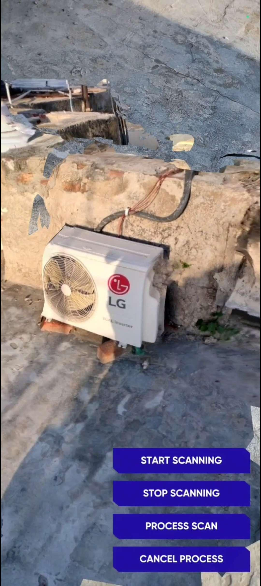

# Realtime Mesh Generation through ARDK's Scanning Feature

## ⚒️ Development Tools
- Unity Engine 2021.3.15f1
- Lightship ARDK 2.5.1
- Visual Studio Code 1.77.1

## 💡 Realtime Mesh Generation Demonstration
